# דוח הפרויקט 

## שער

- **שמות מגישים:** אהוד לאוב ובן גולדשטיין
- **שם המערכת:** בית אבות
- **היחידה הנבחרת:** ניהול פעילויות

---

## תוכן עניינים

### שלב 1 – עיצוב, בנייה ואכלוס נתונים
- [1.1 מבוא](#11-מבוא)
- [1.2 תרשימי ERD וDSD](#12-תרשימי-erd-וdsd)
- [1.3 החלטות עיצוב](#13-החלטות-עיצוב)
- [1.4 שיטות אכלוס הנתונים](#14-שיטות-אכלוס-הנתונים)
- [1.5 גיבוי ושיחזור הנתונים](#15-גיבוי-ושיחזור-הנתונים)

### שלב 2 – שאילתות, אילוצים וטרנזקציות
- [2.1 שאילתות SELECT](#21-שאילתות-select)  
- [2.2 שאילתות DELETE וUPDATE](#22-שאילתות-delete-וupdate)      
- [2.3 טרנזקציות: COMMIT וROLLBACK](#23-טרנזקציות-commit-וrollback)
- [2.4 אילוצים באמצעות ALTER TABLE](#24-אילוצים-באמצעות-alter-table) 

### שלב 1 – עיצוב, בנייה ואכלוס נתונים

## 1.1 מבוא

מערכת זו נועדה לנהל את הפעילות החברתית בבית אבות, כולל דיירים, מדריכים, ספקים, פעילויות ומשוב.  
המערכת עוקבת אחר מי משתתף באיזו פעילות, מי מדריך אותה, אילו ספקים סיפקו שירותים ואילו דיירים שלחו משוב.  
מטרת המערכת היא לייעל את תכנון הפעילויות, תיעוד הספקים והערכת שביעות רצון הדיירים.

---
## 1.2 תרשימי ERD וDSD

### ERD – תרשים ישויות וקשרים:

### DSD – תרשים סכמת הנתונים:

---

## 1.3 החלטות עיצוב

- הקשר בין דייר לפעילות הוא N:M ולכן הופרד לטבלת `Participates` הכוללת תאריך רישום.
- כל פעילות מנוהלת ע"י מדריך (Instructor) – בקשר 1:N.
- קשר `supplies` מתאר אילו ספקים סיפקו שירות לפעילות מסוימת, כולל תאריך ועלות.
- לכל דייר ניתן להוסיף משוב (`Feedback`) על פעילות, כולל דירוג ותגובה מילולית.
- שמרנו על מפתחות ראשיים ו־Foreign Keys כדי להבטיח עקביות במסד הנתונים.

---

## 1.4 שיטות אכלוס הנתונים

### 1.4.1 יצירת סקריפט בפייתון

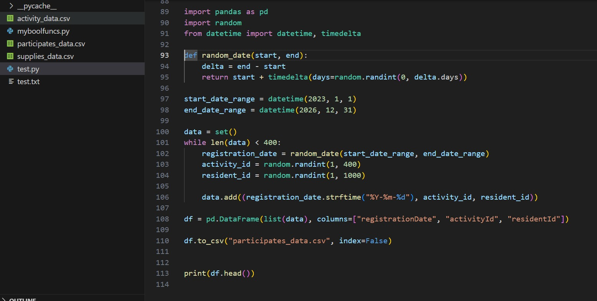

### 1.4.2 שימוש ב־Mockaroo

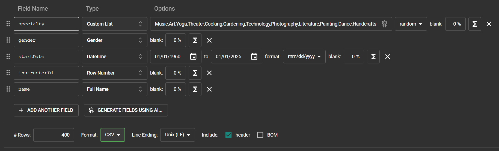

---

## 1.5 גיבוי ושיחזור הנתונים

### גיבוי הנתונים

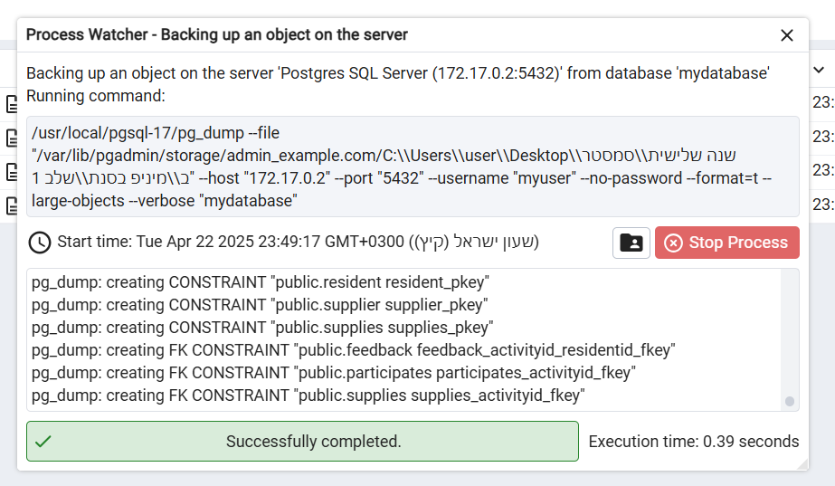

### שיחזור הנתונים

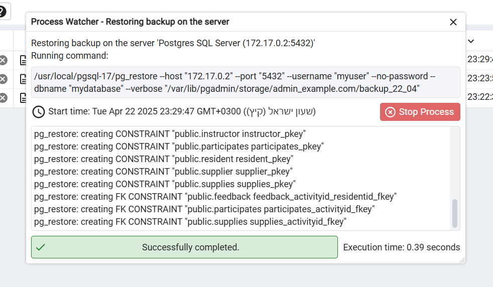

### שלב 2 – שאילתות, אילוצים וטרנזקציות

## 2.1 שאילתות SELECT

### שאילתה 1 – ממוצע פידבק למדריכים
ברצוננו לבדוק אילו מדריכים קיבלו פידבק חיובי באופן עקבי. נבחן מהם המדריכים אשר ממוצע ציוני הפידבק עבור הפעילויות שהם הובילו גבוה מ־3.
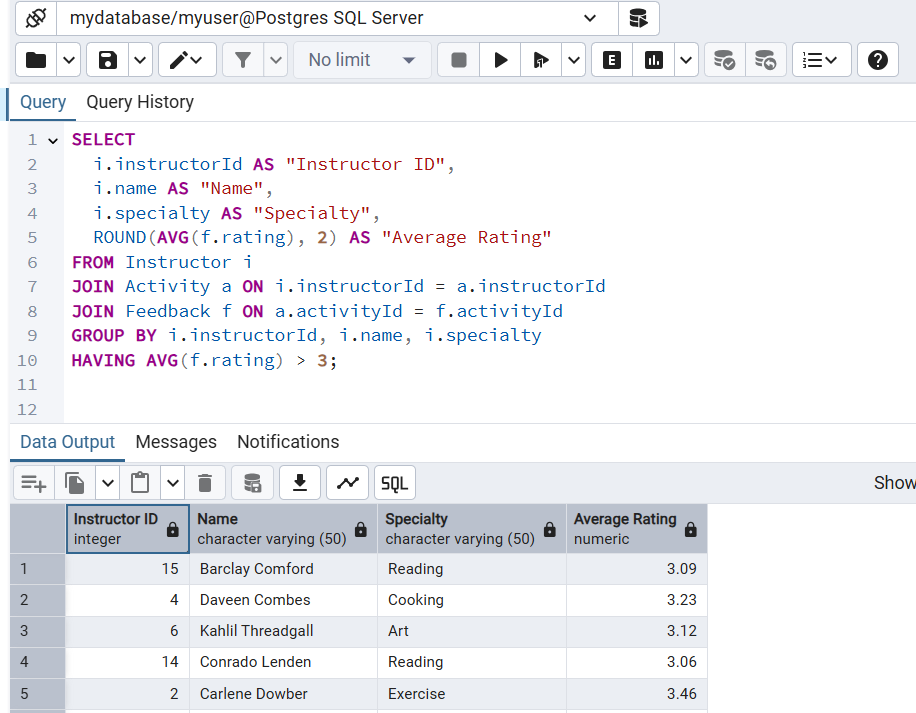

---

### שאילתה 2 – דיירים שנולדו באפריל או מאי ורשומים לפעילות פעילה
נרצה לאתר דיירים שנולדו בחודשים אפריל או מאי, ורשומים לפעילות שעדיין לא הסתיימה, כדי שנוכל להפתיע אותם במהלך הפעילות ולציין את יום הולדתם.
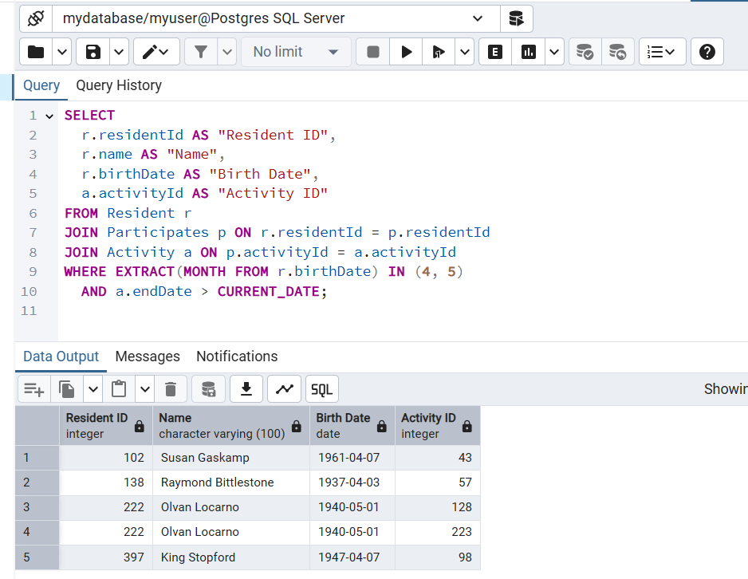

---

### שאילתה 3 – ספקים פעילים השנה וסיכום הוצאות
נרצה לבחון אילו ספקים היו פעילים השנה וסיפקו שירותים לפעילויות שונות בבית האבות. בנוסף, נרצה לדעת כמה פעמים כל ספק סיפק שירות ומה הייתה עלות השירות הכוללת — לצורך בקרה תקציבית ואפשרות להמשך התקשרות.
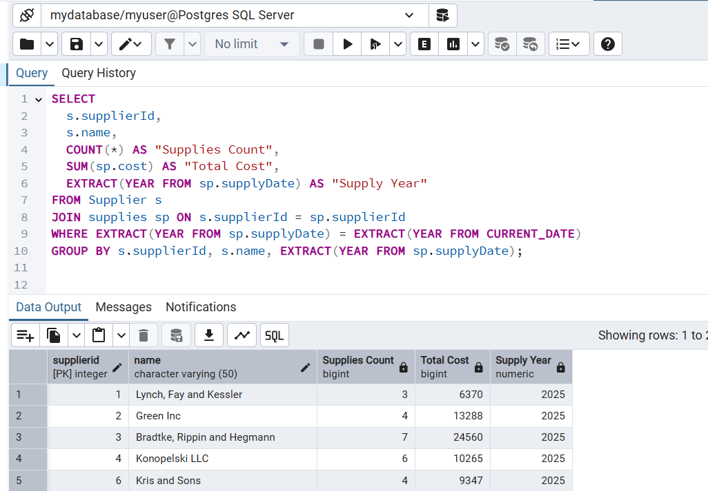

---

### שאילתה 4 – דיירים חדשים שלא השתתפו בפעילות
נרצה לבדוק אילו דיירים הצטרפו בשלוש השנים האחרונות ועדיין לא השתתפו באף פעילות. מידע זה יסייע בזיהוי דיירים חדשים שאינם משולבים בפעילות החברתית וייתכן שיזדקקו לעידוד או ליווי נוסף.
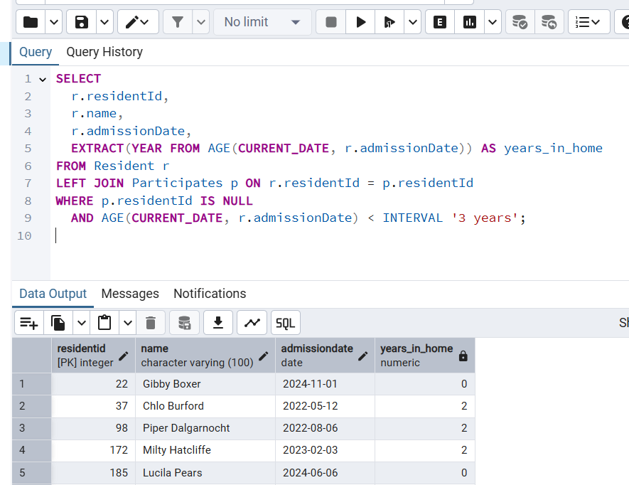

---

### שאילתה 5 – ספקים שסיפקו ציוד אומנות לפעילות אמנותית
נרצה לדעת אילו ספקים מסוג "Art Supplies" סיפקו בפועל שירותים לפעילויות בתחום האמנות ("Art"), וכמה פעמים כל ספק סיפק שירות כזה, כדי שנוכל ליצור קשר עם ספקים מנוסים ולבחון חידוש או הרחבת ההתקשרות.
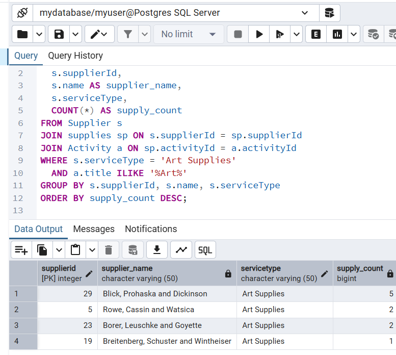

---

### שאילתה 6 – דיירים ששלחו פידבק נמוך בשלוש השנים האחרונות
נרצה לבדוק אילו דיירים נתנו פידבק נמוך (ציון 2 ומטה) לפעילויות שהשתתפו בהן בשלוש השנים האחרונות. המידע מאפשר לזהות חוסר שביעות רצון מתמשך ולקבל החלטות בנוגע לשיפור תכנים או הדרכה.
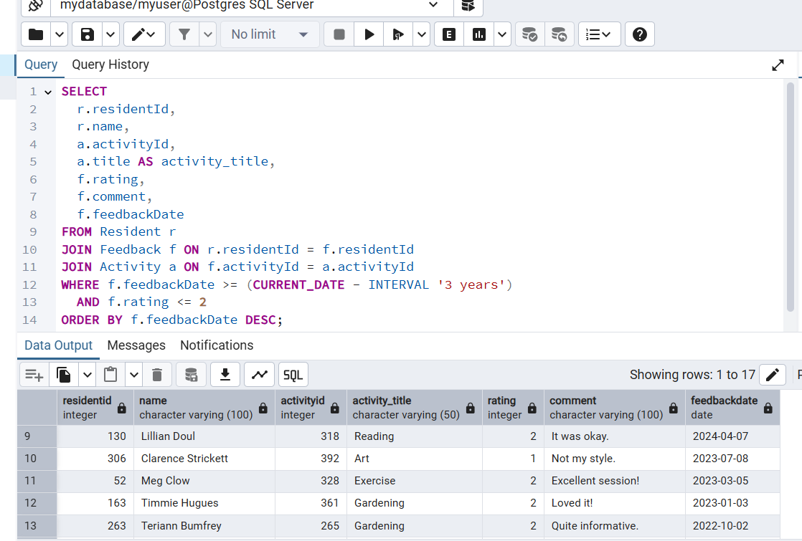

---

### שאילתה 7 – מדריכים פנימיים לפעילויות מוזיקה
נרצה להציג את כל המדריכים הפנימיים (שאינם חיצוניים) שהדריכו פעילויות מהתחום "Music", ולבחון את ממוצע ציוני הפידבק שקיבלו.
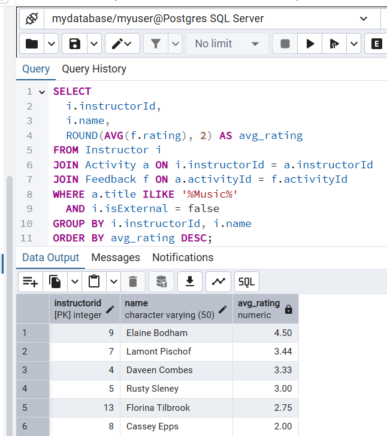

---

### שאילתה 8 – מדריכים עם שיעור השתתפות ממוצע גבוה
נרצה לבדוק אילו מדריכים הובילו פעילויות שבהן שיעור ההשתתפות הממוצע היה מעל 50% מכלל המקומות האפשריים. נציג עבור כל מדריך את תחום ההתמחות שלו, מספר הפעילויות שהעביר, ואת שיעור ההשתתפות הממוצע.
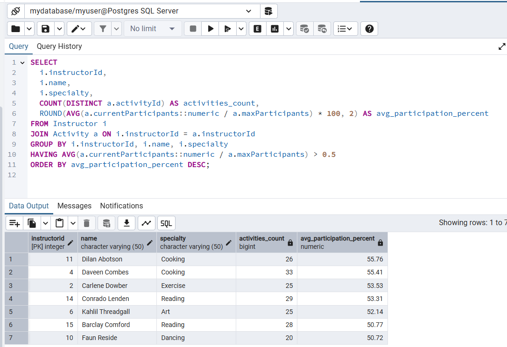

## 2.2 שאילתות DELETE וUPDATE
### שאילתת מחיקה 1 - מחיקת ספק ללא חוזה
נרצה למחוק ספק שאין לו חוזה משנת 2003 ובנוסף סך ההוצאות מכל הההפקות שהוא סיפק קטן ממיליון ש"ח.
שאילתת משנה שמחפשת את כל הספקים שהחוזה שלהם התחיל לפני 2003.
מצטרפת לטבלת supplies כדי לחשב את סך כל ההוצאות (SUM(sp.cost)) על אותו ספק.
מסננת רק ספקים עם סכום כולל של פחות ממיליון ש"ח.
לבסוף, מוחקת אותם מהטבלה Supplier.
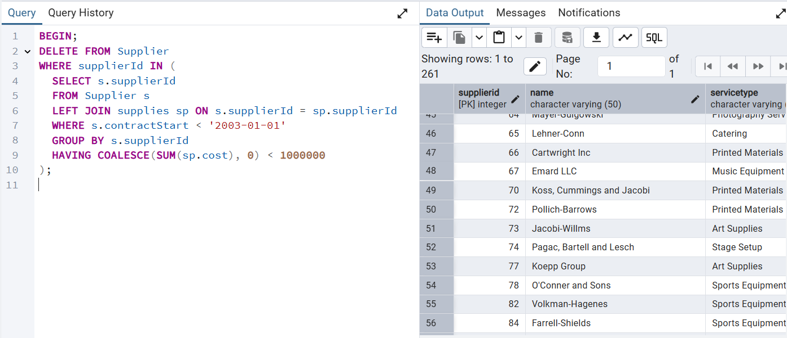
### שאילתת מחיקה 2 - מחיקת מדריך עם פידבק נמוך מ-3
אנחנו בודקים את טבלת Activity, שמכילה את העמודות instructorId ו־feedback.
מחשבים את ממוצע הפידבק לכל instructorId.
בוחרים רק את המדריכים שהממוצע שלהם נמוך מ־3.
לאחר מכן מוחקים את אותם מדריכים מטבלת Instructor.
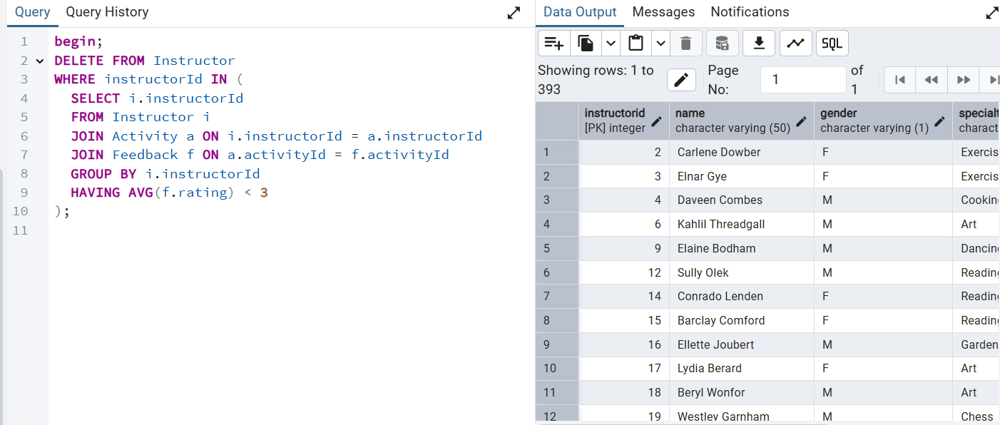
### שאילתת מחיקה 3 -נמחק פידבקים לפעילויות עם דירוג נמוך מ־3
לאחר שמחקנו מדריך עם פידבק נמוך נרצה גם למחוק את הפדבקים עצמם שלא רלוונטים יותר ולכן נמחק אותם על ידי חיבור בין Feedback ל־Activity.
מסננים רק פידבקים לפעילויות שקיבל פידבק נמוך.
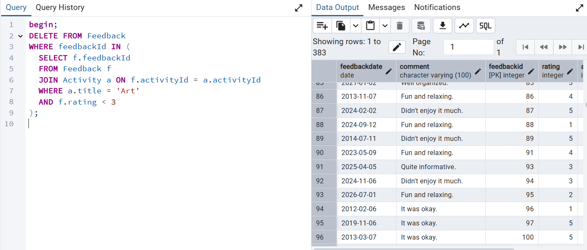
### שאילתת עדכון 1 - עדכון דיירים עם השתתפות גבוהה כפעילים 
נרצה לעדכן את סטטוס הפעילות של הדיירים על ידי הוספת עמודה חדשה לטבלת Resident בשם isActive מסוג BOOLEAN.
לאחר הוספת העמודה, נעדכן אותה כך שכל דייר שהשתתף לפחות בשתי פעילויות בשנתיים האחרונות יסומן כפעיל (TRUE), ואחרים יסומנו כלא פעילים (FALSE).
עדכון זה מאפשר לזהות דיירים פחות מעורבים בפעילויות ולהתאים עבורם פעולות עידוד או מעקב.
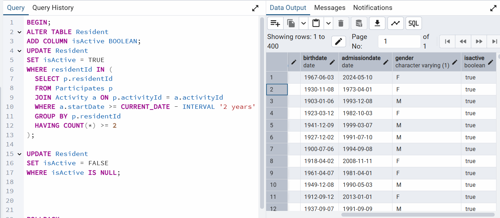
### שאילתת עדכון 2 - עדכון תוכן המשוב לאותיות קטנות
נבצע עדכון על עמודת ה־comment בטבלת Feedback כך שכל התגובות יכילו רק אותיות קטנות. מטרת העדכון היא לאחיד את פורמט התוכן ולשפר את קריאות הנתונים לצורך עיבוד או הצגה.

### שאילתת עדכון 3 - עדכון ספקים יקרים
נוסיף עמודה חדשה לטבלת `Supplier` בשם `isExpensive`, שתציין האם ספק נחשב ליקר.  
העמודה תתמלא אוטומטית לפי ממוצע עלות העסקאות של אותו ספק: אם הממוצע גבוה מ־500 – הערך יסומן כ־TRUE, אחרת FALSE.  
כך נוכל להבחין בין ספקים יקרים וזולים לצורכי בקרה תקציבית והחלטות התקשרות עתידיות.
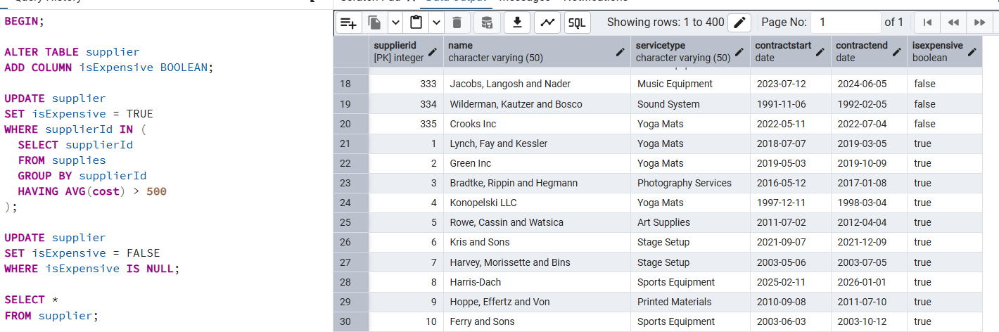
## 2.3 טרנזקציות: COMMIT וROLLBACK
בפרק הקודם (2.2) ביצענו מספר עדכונים ומחיקות כחלק מטרנזקציות, ובסיום כל אחת מהן החלטנו אם לשמור או לבטל את השינויים לפי התאמתם למערכת.

בוצע COMMIT (שמירה סופית של השינויים) עבור:

שאילתת מחיקה 1
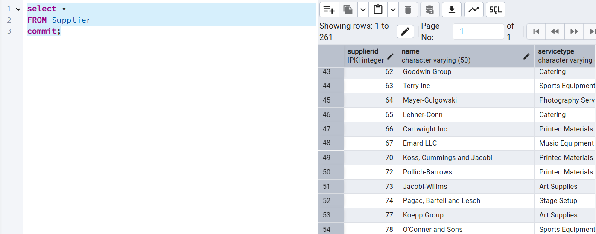
שאילתת מחיקה 2

שאילתת עדכון 2
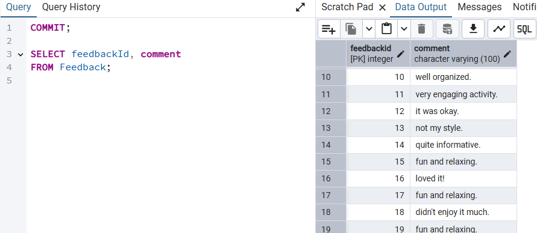

בוצע ROLLBACK (ביטול השינויים) עבור:

שאילתת מחיקה 3
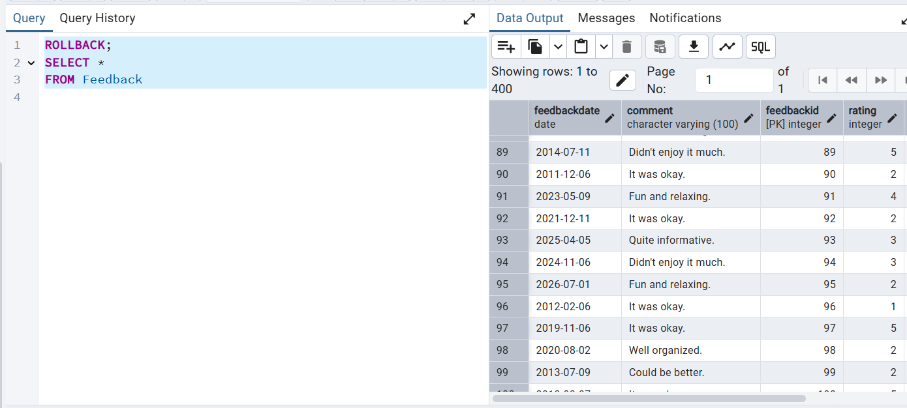
שאילתת עדכון 1
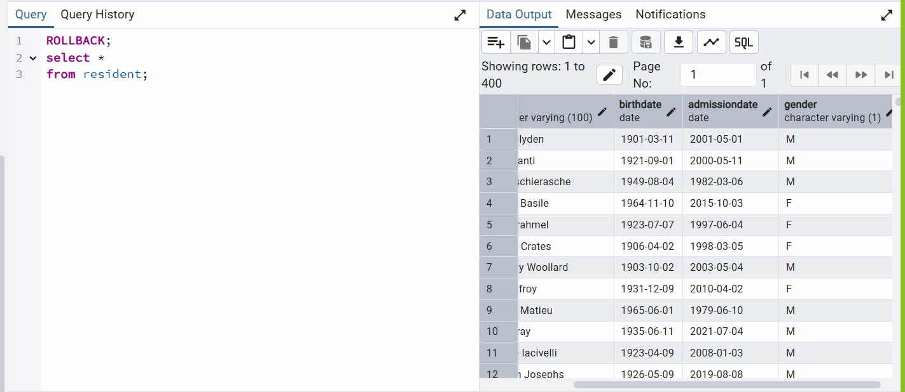
שאילתת עדכון 3
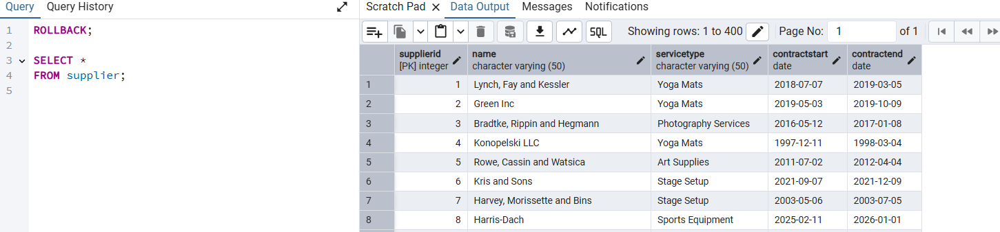

## 2.4 אילוצים באמצעות ALTER TABLE
### אילוץ 1: NOT NULL בטבלת Activity  
הוספת אילוץ שמחייב את שדה `title` להיות לא ריק.

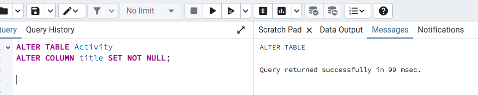 
הוספת שורה עם ערך ריק לשדה title, דבר שגרם לשגיאה עקב אילוץ NOT NULL
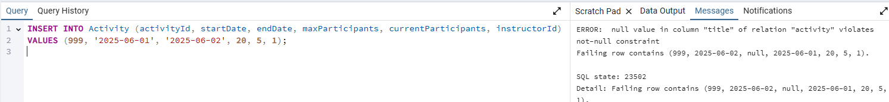

\### אילוץ 2: CHECK בטבלת Feedback  
הוספת תנאי שמוודא שהדירוג (`rating`) נמצא בין 1 ל־5.

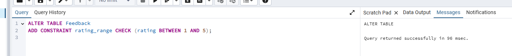  
הוספת שורה עם ערך דירוג 7, החורג מהטווח המותר באילוץ CHECK.
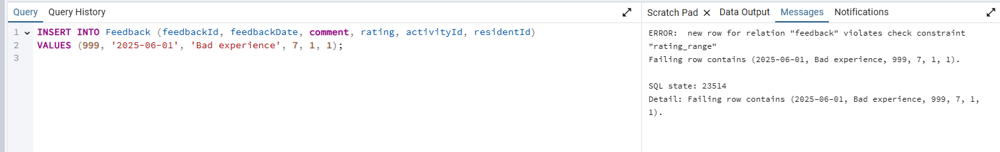

### אילוץ 3: DEFAULT בטבלת Supplier  
הוספת ערך ברירת מחדל `General` לעמודה `serviceType`.

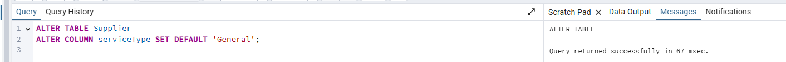  
הוספת שורה ללא ציון סוג שירות – הערך הושלם אוטומטית כ־General בהתאם לערך ברירת המחדל.
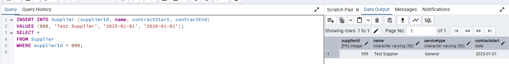

\

