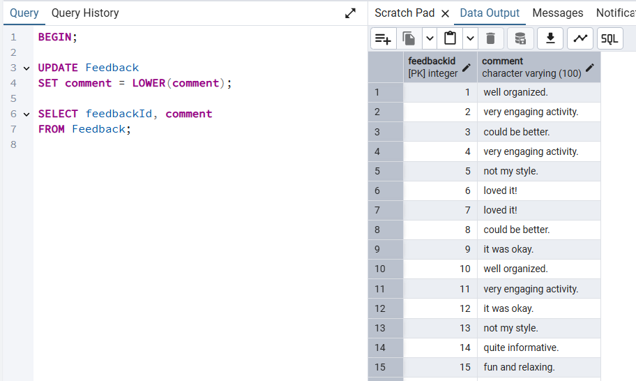
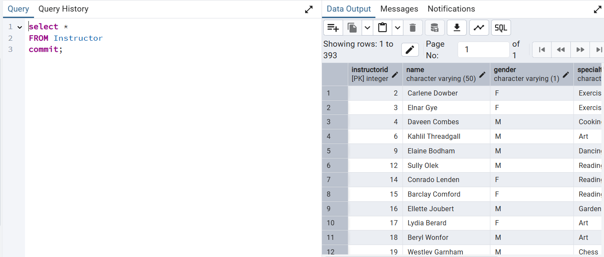

# דוח הפרויקט 

## שער

- **שמות מגישים:** אהוד לאוב ובן גולדשטיין
- **שם המערכת:** בית אבות
- **היחידה הנבחרת:** ניהול פעילויות

---

## תוכן עניינים

### שלב 1 – עיצוב, בנייה ואכלוס נתונים
- [1.1 מבוא](#11-מבוא)
- [1.2 תרשימי ERD וDSD](#12-תרשימי-erd-וdsd)
- [1.3 החלטות עיצוב](#13-החלטות-עיצוב)
- [1.4 שיטות אכלוס הנתונים](#14-שיטות-אכלוס-הנתונים)
- [1.5 גיבוי ושיחזור הנתונים](#15-גיבוי-ושיחזור-הנתונים)

### שלב 2 – שאילתות, אילוצים וטרנזקציות
- [2.1 שאילתות SELECT](#21-שאילתות-select)  
- [2.2 שאילתות DELETE וUPDATE](#22-שאילתות-delete-וupdate)      
- [2.3 טרנזקציות: COMMIT וROLLBACK](#23-טרנזקציות-commit-וrollback)
- [2.4 אילוצים באמצעות ALTER TABLE](#24-אילוצים-באמצעות-alter-table) 

### שלב 3 – אינטגרציה ומבטים
- [3.1 תרשימים](#31-תרשימים)
- [3.2 החלטות אינטגרציה](#32-החלטות-אינטגרציה)
- [3.3 עדכון טבלאות לצורך אינטגרציה](#33-עדכון-טבלאות-לצורך-אינטגרציה)
- [3.4 יצירת views ו-שאילתות חדשות](#34-יצירת-views-ו-שאילתות-חדשות)


### שלב 4 – פונקציות, פרוצדורות וטריגרים
- [4.1 פונקציות](#41-פונקציות)
- [4.2 פרוצדורות](#42-פרוצדורות)
- [4.3 טריגרים](#43-טריגרים)

### שלב 1 – עיצוב, בנייה ואכלוס נתונים

## 1.1 מבוא

מערכת זו נועדה לנהל את הפעילות החברתית בבית אבות, כולל דיירים, מדריכים, ספקים, פעילויות ומשוב.  
המערכת עוקבת אחר מי משתתף באיזו פעילות, מי מדריך אותה, אילו ספקים סיפקו שירותים ואילו דיירים שלחו משוב.  
מטרת המערכת היא לייעל את תכנון הפעילויות, תיעוד הספקים והערכת שביעות רצון הדיירים.

---
## 1.2 תרשימי ERD וDSD


### ERD – תרשים ישויות וקשרים:


### DSD – תרשים סכמת הנתונים:


---

## 1.3 החלטות עיצוב

- הקשר בין דייר לפעילות הוא N:M ולכן הופרד לטבלת `Participates` הכוללת תאריך רישום.
- כל פעילות מנוהלת ע"י מדריך (Instructor) – בקשר 1:N.
- קשר `supplies` מתאר אילו ספקים סיפקו שירות לפעילות מסוימת, כולל תאריך ועלות.
- לכל דייר ניתן להוסיף משוב (`Feedback`) על פעילות, כולל דירוג ותגובה מילולית.
- שמרנו על מפתחות ראשיים ו־Foreign Keys כדי להבטיח עקביות במסד הנתונים.

---

## 1.4 שיטות אכלוס הנתונים

### 1.4.1 יצירת סקריפט בפייתון


### 1.4.2 שימוש ב־Mockaroo


---

## 1.5 גיבוי ושיחזור הנתונים

### גיבוי הנתונים


### שיחזור הנתונים


### שלב 2 – שאילתות, אילוצים וטרנזקציות

## 2.1 שאילתות SELECT

### שאילתה 1 – ממוצע פידבק למדריכים
ברצוננו לבדוק אילו מדריכים קיבלו פידבק חיובי באופן עקבי. נבחן מהם המדריכים אשר ממוצע ציוני הפידבק עבור הפעילויות שהם הובילו גבוה מ־3.


---

### שאילתה 2 – דיירים שנולדו באפריל או מאי ורשומים לפעילות פעילה
נרצה לאתר דיירים שנולדו בחודשים אפריל או מאי, ורשומים לפעילות שעדיין לא הסתיימה, כדי שנוכל להפתיע אותם במהלך הפעילות ולציין את יום הולדתם.


---

### שאילתה 3 – ספקים פעילים השנה וסיכום הוצאות
נרצה לבחון אילו ספקים היו פעילים השנה וסיפקו שירותים לפעילויות שונות בבית האבות. בנוסף, נרצה לדעת כמה פעמים כל ספק סיפק שירות ומה הייתה עלות השירות הכוללת — לצורך בקרה תקציבית ואפשרות להמשך התקשרות.


---

### שאילתה 4 – דיירים חדשים שלא השתתפו בפעילות
נרצה לבדוק אילו דיירים הצטרפו בשלוש השנים האחרונות ועדיין לא השתתפו באף פעילות. מידע זה יסייע בזיהוי דיירים חדשים שאינם משולבים בפעילות החברתית וייתכן שיזדקקו לעידוד או ליווי נוסף.


---

### שאילתה 5 – ספקים שסיפקו ציוד אומנות לפעילות אמנותית
נרצה לדעת אילו ספקים מסוג "Art Supplies" סיפקו בפועל שירותים לפעילויות בתחום האמנות ("Art"), וכמה פעמים כל ספק סיפק שירות כזה, כדי שנוכל ליצור קשר עם ספקים מנוסים ולבחון חידוש או הרחבת ההתקשרות.


---

### שאילתה 6 – דיירים ששלחו פידבק נמוך בשלוש השנים האחרונות
נרצה לבדוק אילו דיירים נתנו פידבק נמוך (ציון 2 ומטה) לפעילויות שהשתתפו בהן בשלוש השנים האחרונות. המידע מאפשר לזהות חוסר שביעות רצון מתמשך ולקבל החלטות בנוגע לשיפור תכנים או הדרכה.


---

### שאילתה 7 – מדריכים פנימיים לפעילויות מוזיקה
נרצה להציג את כל המדריכים הפנימיים (שאינם חיצוניים) שהדריכו פעילויות מהתחום "Music", ולבחון את ממוצע ציוני הפידבק שקיבלו.


---

### שאילתה 8 – מדריכים עם שיעור השתתפות ממוצע גבוה
נרצה לבדוק אילו מדריכים הובילו פעילויות שבהן שיעור ההשתתפות הממוצע היה מעל 50% מכלל המקומות האפשריים. נציג עבור כל מדריך את תחום ההתמחות שלו, מספר הפעילויות שהעביר, ואת שיעור ההשתתפות הממוצע.


## 2.2 שאילתות DELETE וUPDATE
### שאילתת מחיקה 1 - מחיקת ספק ללא חוזה
נרצה למחוק ספק שאין לו חוזה משנת 2003 ובנוסף סך ההוצאות מכל הההפקות שהוא סיפק קטן ממיליון ש"ח.
שאילתת משנה שמחפשת את כל הספקים שהחוזה שלהם התחיל לפני 2003.
מצטרפת לטבלת supplies כדי לחשב את סך כל ההוצאות (SUM(sp.cost)) על אותו ספק.
מסננת רק ספקים עם סכום כולל של פחות ממיליון ש"ח.
לבסוף, מוחקת אותם מהטבלה Supplier.

### שאילתת מחיקה 2 - מחיקת מדריך עם פידבק נמוך מ-3
אנחנו בודקים את טבלת Activity, שמכילה את העמודות instructorId ו־feedback.
מחשבים את ממוצע הפידבק לכל instructorId.
בוחרים רק את המדריכים שהממוצע שלהם נמוך מ־3.
לאחר מכן מוחקים את אותם מדריכים מטבלת Instructor.

### שאילתת מחיקה 3 -נמחק פידבקים לפעילויות עם דירוג נמוך מ־3
לאחר שמחקנו מדריך עם פידבק נמוך נרצה גם למחוק את הפדבקים עצמם שלא רלוונטים יותר ולכן נמחק אותם על ידי חיבור בין Feedback ל־Activity.
מסננים רק פידבקים לפעילויות שקיבל פידבק נמוך.

### שאילתת עדכון 1 - עדכון דיירים עם השתתפות גבוהה כפעילים 
נרצה לעדכן את סטטוס הפעילות של הדיירים על ידי הוספת עמודה חדשה לטבלת Resident בשם isActive מסוג BOOLEAN.
לאחר הוספת העמודה, נעדכן אותה כך שכל דייר שהשתתף לפחות בשתי פעילויות בשנתיים האחרונות יסומן כפעיל (TRUE), ואחרים יסומנו כלא פעילים (FALSE).
עדכון זה מאפשר לזהות דיירים פחות מעורבים בפעילויות ולהתאים עבורם פעולות עידוד או מעקב.

### שאילתת עדכון 2 - עדכון תוכן המשוב לאותיות קטנות
נבצע עדכון על עמודת ה־comment בטבלת Feedback כך שכל התגובות יכילו רק אותיות קטנות. מטרת העדכון היא לאחיד את פורמט התוכן ולשפר את קריאות הנתונים לצורך עיבוד או הצגה.

### שאילתת עדכון 3 - עדכון ספקים יקרים
נוסיף עמודה חדשה לטבלת `Supplier` בשם `isExpensive`, שתציין האם ספק נחשב ליקר.  
העמודה תתמלא אוטומטית לפי ממוצע עלות העסקאות של אותו ספק: אם הממוצע גבוה מ־500 – הערך יסומן כ־TRUE, אחרת FALSE.  
כך נוכל להבחין בין ספקים יקרים וזולים לצורכי בקרה תקציבית והחלטות התקשרות עתידיות.

## 2.3 טרנזקציות: COMMIT וROLLBACK
בפרק הקודם (2.2) ביצענו מספר עדכונים ומחיקות כחלק מטרנזקציות, ובסיום כל אחת מהן החלטנו אם לשמור או לבטל את השינויים לפי התאמתם למערכת.

בוצע COMMIT (שמירה סופית של השינויים) עבור:

שאילתת מחיקה 1

שאילתת מחיקה 2

שאילתת עדכון 2



בוצע ROLLBACK (ביטול השינויים) עבור:

שאילתת מחיקה 3

שאילתת עדכון 1

שאילתת עדכון 3


## 2.4 אילוצים באמצעות ALTER TABLE
### אילוץ 1: NOT NULL בטבלת Activity  
הוספת אילוץ שמחייב את שדה `title` להיות לא ריק.

 
הוספת שורה עם ערך ריק לשדה title, דבר שגרם לשגיאה עקב אילוץ NOT NULL


### אילוץ 2: CHECK בטבלת Feedback  
הוספת תנאי שמוודא שהדירוג (`rating`) נמצא בין 1 ל־5.

  
הוספת שורה עם ערך דירוג 7, החורג מהטווח המותר באילוץ CHECK.


### אילוץ 3: DEFAULT בטבלת Supplier  
הוספת ערך ברירת מחדל `General` לעמודה `serviceType`.

  
הוספת שורה ללא ציון סוג שירות – הערך הושלם אוטומטית כ־General בהתאם לערך ברירת המחדל.


---
### שלב 3 – אינטגרציה ומבטים

בשלב זה ביצענו אינטגרציה בין מסד הנתונים שלנו לבין מסד הנתונים של אגף נוסף (שהתקבל מגיבוי). האינטגרציה כללה בניית תרשימים, תכנון מחדש של המערכת, ביצוע שינויים בסכמת הנתונים, והוספת מבטים לייצוג מידע בצורה ממוקדת.

---

## 3.1 תרשימים

#### 3.1.1 תרשים DSD שהתקבל לאחר ניתוח הגיבוי.


#### 3.1.2 סכמת ERD שהתקבלה לאחר הינדוס לאחור.


#### 3.1.3 סכמת ERD משולבת.


#### 3.1.4 תרשים DSD משולב.


## 3.2 החלטות אינטגרציה

---
במהלך המיזוג נדרשו מספר התאמות:

Resident:

הישות שלהם הייתה פשוטה יותר ולכן בחרנו לשלב את השדות שלה בתוך הישות שלנו. שמרנו על שמות השדות הקיימים אצלנו, תוך התאמה במידת הצורך.

Activity / Event:

אוחדו לישות אחת בשם Activity. בוצעו התאמות לשמות שדות: השדה name הפך ל־title, eventDate הפך ל־startDate, והוספנו את השדה eventLocation לישות המאוחדת, שלא היה קיים במערכת שלנו.

VisitingEvent / Participates:

שתי היישויות מתארות השתתפות דייר בפעילות. בחרנו לשמור את הישות Participates שלנו, שכן היא מכילה תכונה נוספת (registrationDate) וכן מתארת טוב יותר את הקשר הקיים.

שאר הישויות (כגון: room, maintenance_rep, inventory, staff_member, meal) הן ייחודיות למערכת של האגף החדש, ולכן שולבו בתרשים המשותף כפי שהן – ללא שינוי.

החלטות אלו נועדו לשמר עקביות, למנוע כפילויות ולשלב את המידע בצורה אינטגרטיבית בין האגפים.


## 3.3 עדכון טבלאות לצורך אינטגרציה
---
בשלב זה ביצענו שינויים במסד הנתונים כדי לשלב את טבלת `resident` שהתקבלה מהאגף הנוסף, תוך שמירה על הקשרים הקיימים בטבלה שלנו. להלן סדר הפעולות:


שלב 1 - מיזוג ישות resident:
-   הוספת עמודה room_id לטבלת resident1
```sql
ALTER TABLE resident1 ADD COLUMN room_id INT;
```

- הוספת מפתח זר לטבלה resident
```sql
ALTER TABLE resident1
ADD CONSTRAINT fk_room FOREIGN KEY (room_id)
REFERENCES room(room_id);
```

- עדכון הערכים בעמודה room_id מהטבלה שהתקבלה
```sql
UPDATE resident1 r1
SET room_id = r2.room_id
FROM resident r2
WHERE r1.residentId = r2.resident_id;
```
שלב 2 - מיזוג 'event' ו'activity' לישות אחת:
-   הוספת עמודה activity_location לטבלת activity
```sql
ALTER TABLE Activity ADD COLUMN activity_location VARCHAR(100);
``` 
- מיזוג טבלת event לתוך Activity
```sql
INSERT INTO Activity (
  activityId, startDate, endDate, title,
  maxParticipants, currentParticipants, instructorId, activity_location
)
SELECT 
  event_id,
  event_date,
  event_date,
  event_name,
  100,
  0,
  1,
  event_location
FROM event
WHERE event_id NOT IN (SELECT activityId FROM Activity);
```
שלב 3 - מיזוג הקשר 'visiting_event' והישות החלשה 'participates' לישות חלשה אחת:
- מיזוג טבלת 'visiting_event' לתוך טבלת 'participates'
```sql
INSERT INTO Participates (residentId, activityId, registrationDate)
SELECT 
  ve.resident_id,
  ve.event_id,
  a.startDate
FROM visiting_event ve
JOIN Activity a ON ve.event_id = a.activityId
WHERE (ve.resident_id, ve.event_id) NOT IN (
  SELECT p.residentId, p.activityId
  FROM Participates p
);
``` 

## 3.4  יצירת views ו-שאילתות חדשות
---
נבנה view ושאילתות חדשות על בסיס הוספת הטבלאות והעמודות החדשות.
#### 3.4.1 מבט מהאגף המקורי שלנו
ניצור מבט בשם resident_activities_view שמשלב בין מידע על דיירים לבין מידע על פעילויות שהם משתתפים בהן.
```sql
CREATE VIEW resident_activities_view AS
SELECT 
    r.residentid,
    r.name,
    r.birthDate,
    a.activityid,
    a.title,
    a.startdate,
    a.activity_location
FROM resident r
JOIN participates p ON r.residentid = p.residentid
JOIN activity a ON p.activityid = a.activityid;
```
נשלוף את הנתונים מהמבט.


ניצור שאילתה המבוססת על המבט resident_activities_view, השאילתה מציגה את מספר הפעיליות בהם השתתף כל דייר.

```sql
SELECT residentid, name, COUNT(*) AS total_activities
FROM resident_activities_view
GROUP BY residentid, name
ORDER BY total_activities DESC;
```


ניצור שאילתה נוספת המבוססת על מבט resident_activities_view, שאילתה זאת מציגה את מספר הפעיליות לפי מקום.
```sql
SELECT activity_location, COUNT(*) AS activity_count
FROM resident_activities_view
GROUP BY activity_location
ORDER BY activity_count DESC;
```


#### 3.4.2 מבט מהאגף שהתקבל
ניצור מבט נוסף בשם staff_tasks_view שמשלב בין מידע על בקשות תחזוקה לבין מידע על פרטי העובדים המטפלים בבקשות התחזוקה.
```sql
CREATE VIEW staff_tasks_view AS
SELECT 
    s.staff_member_id,
    s.staff_member_name,
    s.job_title,
    r.request_id,
    r.req_description,
    r.req_status
FROM staff_member s
JOIN maintenance_req r ON s.staff_member_id = r.staff_member_id;

SELECT * FROM staff_tasks_view;
```
נשלוף את הנתנונים מהמבט.

ניצור שאילתה המבוססת על המבט staff_tasks_view, השאילתה מציגה את מספר בקשות התחזוקה שכל עובד טיפל בהן בפועל.
```sql
SELECT 
  staff_member_id,
  staff_member_name,
  COUNT(*) AS total_requests
FROM staff_tasks_view
GROUP BY staff_member_id, staff_member_name
ORDER BY total_requests DESC;
```

ניצור שאילתה נוספת המבוססת על מבט staff_tasks_view, שאילתה זאת מציגה את מספר בקשות התחזוקה שעדיין פתוחות, עבור כל תפקיד במערכת.
```sql
SELECT 
  job_title,
  COUNT(*) AS open_requests
FROM staff_tasks_view
WHERE req_status = 'open'
GROUP BY job_title
ORDER BY open_requests DESC;
```


### שלב 4 – פונקציות, פרוצדורות וטריגרים
בשלב זה נכתוב תוכניות PL/pgSQL על טבלאות בסיס הנתונים המורחב שלנו
## 4.1 פונקציות
נכתב שתיי פונקציות לא שיתנו לנו מידע לא טרויאלי.
פונקציה ראשונה תמצא לנו את כל הדיירים בני 80 ומעלה.
הקוד מפעיל פונקציה שמחזירה קורסור עם רשימת דיירים מבוגרים, ומבצע לולאת FETCH על כל שורה מתוכו.
בכל איטרציה הוא מדפיס את מספר תעודת הזהות, השם ותאריך הלידה של הדייר באמצעות RAISE NOTICE.
הפונקציה עצמה כנראה מבצעת SELECT מטבלת resident עם סינון על גיל .


 

פונקציה שנייה מחזירה refcursor עם סיכום ביקורים של כל דייר. כוללת רשומות, לולאה, תנאי, חריגה (EXCEPTION), ו־DML פנימי.
הפונקציה func_resident_visit_summary מחזירה סיכום של מספר הביקורים לכל דייר באמצעות refcursor.
היא יוצרת טבלה זמנית, מבצעת שאילתת הצטרפות בין resident ל־visiting_event, מחשבת את סך הביקורים לכל דייר, ושומרת אותם לטבלה זמנית שממנה היא מחזירה את התוצאה.
בנוסף, היא בודקת אם קיימים דיירים לפני הריצה ואם לא – זורקת חריגה

 

הרצת שניי הפונקציות תתן לנו פלט של 652 שורות התוכנוית המלאה בקובץ sql בתייקיה
 
## 4.2 פרוצדורות
פרוצדורה 1
מסמנת דיירים שנמצאים במוסד מעל 10 שנים כ־"Veteran". כוללת CURSOR מפורש, לולאה, עדכון (UPDATE), הסתעפות ו־Exception.
בשביל הפרצדורה הזאת היה צריך לעשות עידכון באפיון ולהוסיף עמודת sutus בטבלת resident.

 
פרוצדורה 2
הפרוצדורה proc_delete_empty_staff_roles מזהה אנשי צוות שטור התפקיד (job_title) שלהם ריק או NULL, ומוחקת אותם מהטבלה.
היא משתמשת בקורסור כדי לעבור אחד-אחד על השורות המתאימות, ומבצעת DELETE עם טיפול בשגיאות – כולל RAISE NOTICE למחיקה מוצלחת או RAISE WARNING במקרה של שגיאה.


 

תוכנית ראשית להרצת 2 הפרוצדורות פלט של 1330 שורות

 

## 4.3 טריגרים
נעשה טריגרים שכאשר קורה כשהאירוע (Insert, Update) הוא יפעל.

טריגר 1
נרצה שכאשר מנסים לשנות תאריך לידה של דייר אז תיזרק שגיאה.
הטריגר trg_block_update_birthdate נועד למנוע עדכון של שדה תאריך הלידה (birthdate) בטבלת resident.
הוא מופעל לפני כל עדכון (BEFORE UPDATE) ומשתמש בפונקציה prevent_birthdate_update שבודקת אם הערך החדש שונה מהישן – ובמקרה שכן, זורקת חריגה עם הודעת שגיאה מותאמת אישית.
כך נשמרת שלמות הנתונים, והמשתמש אינו יכול לשנות תאריך לידה לדייר קיים.

 
טריגר 2 
נרצה שכאשר מנסים להוסיף דייר קיים תיזרק שגיאה.
עשינו טריגר בשם trg_notify_insert שמופעל לאחר הכנסת שורה חדשה (AFTER INSERT) לטבלת resident.
הטריגר מפעיל פונקציה my_trigger_func שמבצעת הודעת מערכת (RAISE NOTICE) – במקרה הזה עם הטקסט "נוספה שורה".
כך בכל הוספה של דייר חדש, תופיע הודעה מיידית שמאשרת שהשורה הוכנסה, מבלי לשנות את הנתונים עצמם.
 
